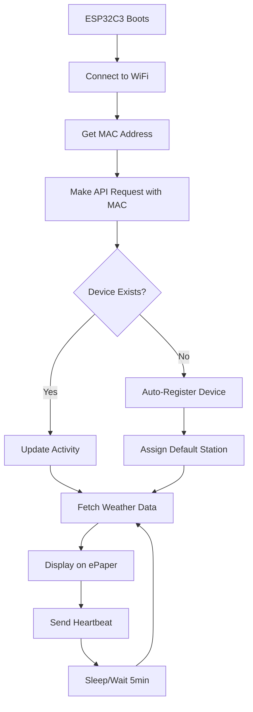

# ESP32C3 Weather Display - Setup Guide

Complete guide for setting up the ESP32C3 Weather Display firmware.

## 🎯 Quick Start (5 minutes)

1. **Install Arduino IDE** (version 2.0+)
2. **Add ESP32 boards**: File → Preferences → Additional Boards Manager URLs:
   ```
   https://raw.githubusercontent.com/espressif/arduino-esp32/gh-pages/package_esp32_index.json
   ```
3. **Install ESP32 boards**: Tools → Board → Boards Manager → search "ESP32" → Install
4. **Install required libraries** (Tools → Manage Libraries):
   - `ArduinoJson` by Benoit Blanchon
   - `TFT_eSPI` (if using ePaper display)

5. **Configure WiFi**: Copy `secrets.h.example` to `secrets.h` and add your WiFi credentials
6. **Upload** to your XIAO ESP32C3
7. **Monitor** Serial output at 115200 baud

## 🔧 Hardware Setup

### XIAO ESP32C3 Board
- **USB-C**: For programming and power
- **Built-in LED**: Pin 21 (status indicator)
- **BOOT Button**: Pin 9 (for identify feature)

### ePaper Display (Optional)
If using Seeed 7.5" ePaper Driver Board:
- Connect via pre-defined pins in `driver.h`
- No additional wiring required with driver board

### Pin Configuration
```cpp
// Status LED (built-in)
#define LED_BUILTIN 21

// ePaper pins (if using driver board)
#define EPAPER_SCK   8   // D8 - SCLK
#define EPAPER_MOSI  10  // D10 - MOSI
#define EPAPER_CS    1   // D1 - CS
#define EPAPER_DC    3   // D3 - DC
#define EPAPER_RST   0   // D0 - RST
#define EPAPER_BUSY  2   // D2 - BUSY
```

## 📝 Configuration

### WiFi Setup (`secrets.h`)
```cpp
// Add your WiFi networks (strongest first)
const WiFiNetwork WIFI_NETWORKS[] = {
  {"HomeWiFi", "your_password"},
  {"MobileHotspot", "hotspot_pass"},
  {"OfficeGuest", "guest_pass"}
};
```

### Weather Station Selection
Choose your default weather station in `secrets.h`:

| Station ID | Location | Elevation | Type |
|------------|----------|-----------|------|
| `prarion` | Prarion (Les Houches) | 1,865m | Alpine |
| `tetedebalme` | Tête de Balme | 2,204m | Alpine |
| `planpraz` | Planpraz | 1,958m | Alpine |
| `brambles` | Brambles Bank | Sea level | Marine |
| `seaview` | Seaview, Isle of Wight | Sea level | Marine |
| `lymington` | Lymington, Hampshire | Sea level | Marine |

### Power Management
```cpp
#define ENABLE_DEEP_SLEEP 1      // Battery operation
#define SLEEP_MINUTES 5          // Sleep between updates
```

## 🚀 Upload Process

1. **Connect** XIAO ESP32C3 via USB-C
2. **Select Board**: Tools → Board → ESP32 Arduino → XIAO_ESP32C3
3. **Select Port**: Tools → Port → (your device)
4. **Verify Code**: Sketch → Verify/Compile
5. **Upload**: Sketch → Upload

## 📊 Monitoring

### Serial Monitor
Open Serial Monitor (115200 baud) to see:
```
========================================
  Weather Display Integrated v1.0
  XIAO ESP32C3 + 7.5" ePaper
========================================
Device MAC: AA:BB:CC:DD:EE:FF
Device ID: aabbccddeeff
WiFi connected! IP: 192.168.1.100
Device registered! Assigned station: prarion
Weather data updated successfully
```

### Device Registration
When first connecting, the device will:
1. Auto-register with the backend using its MAC address
2. Get assigned a weather station based on the endpoint
3. Appear in the web management interface

## 🌐 Web Interface

After first connection, visit: https://0b4669b0.weather-management.pages.dev

### Device Management
- **View Device**: Click "Devices" tab to see your registered device
- **Rename Device**: Click on device name to edit
- **Change Station**: Use dropdown to reassign weather station
- **Identify Device**: Click "Identify" to flash the display
- **Monitor Status**: Real-time online/offline status

## 📱 Device Auto-Registration Flow



## 🔧 Troubleshooting

### WiFi Connection Issues
```
Problem: WiFi not connecting
Solution: 
- Check SSID/password spelling (case-sensitive)
- Move closer to router
- Try different network from list
- Check Serial Monitor for detailed errors
```

### Device Not Appearing in Web Interface
```
Problem: Device not visible online
Solution:
- Check backend health: https://weather-backend.nativenav.workers.dev/health
- Verify MAC parameter in API request
- Check Serial Monitor for HTTP response codes
- Try manual device scan in web interface
```

### ePaper Display Issues
```
Problem: Display not updating
Solution:
- Check pin connections (if using custom wiring)
- Verify TFT_eSPI library installation
- Check EPAPER_ENABLE in driver.h
- Monitor memory usage (heap)
```

### Memory Issues
```
Problem: Device crashes/reboots
Solution:
- Monitor heap memory in Serial Monitor
- Reduce JSON buffer size if needed
- Disable debug output for production
- Consider enabling deep sleep
```

## 🔒 Security Notes

- **WiFi Credentials**: Never commit `secrets.h` to version control
- **Device Authentication**: Uses MAC address by default
- **HTTPS**: All backend communication uses TLS
- **Rate Limiting**: Backend prevents abuse automatically

## 🔋 Battery Operation

For battery-powered operation:
```cpp
#define ENABLE_DEEP_SLEEP 1
#define SLEEP_MINUTES 5
```

This will:
- Sleep between weather updates
- Wake every 5 minutes
- Update display and go back to sleep
- Greatly extend battery life

## 📈 Advanced Features

### Custom Backend
```cpp
#define BACKEND_URL "https://your-backend.example.com"
```

### Debug Output
```cpp
#define ENABLE_SERIAL_OUTPUT 0  // Disable for production
```

### Error Recovery
The firmware includes:
- Automatic WiFi reconnection
- HTTP request retries
- Cached demo data fallback
- Watchdog protection

## 📦 Required Libraries

Install these libraries via Arduino IDE Library Manager:

```
ArduinoJson (>= 6.19.0)
  - JSON parsing for weather data
  - Efficient memory usage
  - Error handling

TFT_eSPI (>= 2.4.0) [Optional]
  - ePaper display driver
  - Anti-ghosting support  
  - Partial refresh capability

ESP32 Arduino Core (>= 2.0.0)
  - WiFi management
  - HTTP client
  - Preferences storage
```

## 🎯 Success Indicators

Your setup is working correctly when you see:

1. ✅ **WiFi Connected**: Device gets IP address
2. ✅ **Device Registered**: HTTP 201 response on first API call
3. ✅ **Weather Data**: Valid JSON response with current conditions
4. ✅ **Display Update**: ePaper shows weather information
5. ✅ **Web Interface**: Device appears in management interface
6. ✅ **Identify Works**: Display flashes when identify button clicked

## 🆘 Support

- **Backend Status**: https://weather-backend.nativenav.workers.dev/health
- **Web Interface**: https://0b4669b0.weather-management.pages.dev
- **API Documentation**: See `/docs/ESP32C3-INTEGRATION.md`

---

*Happy weather monitoring! 🌤️*
